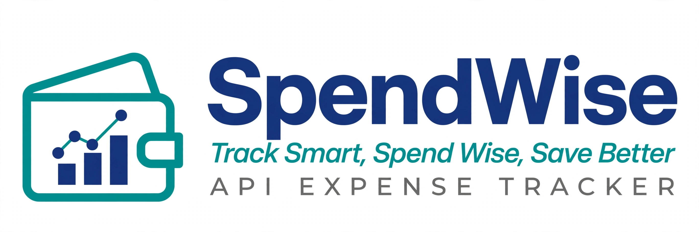

<p align="center">
  
</p>

<h1 align="center">BD SPENDWISE API</h1>
<p align="center">Track Smart, Spend Wise, Save Better</p>

<p align="center">
  <a href="https://bd-spendwise-api.onrender.com"></a>
  <a href="https://bd-spendwise-api.docs.buildwithfern.com"></a>
  <a href="#"></a>
</p>

---

### 📖 About
BD SpendWise API is a secure REST API for managing personal expenses. Built as a capstone project by Group 3B - Back End Development September Cohort 2026.

### 🔗 Links
- **Live URL:** https://bd-spendwise-api.onrender.com
- **Documentation:** https://bd-spendwise-api.docs.buildwithfern.com
- **GitHub:** https://github.com/Digi-tal682/BD-SPENDWISE-API

### 🚀 Features
- 🔐 JWT Authentication (Register/Login)
- 💸 Expense CRUD Operations
- 📊 Category Management
- 🔍 Filter & Search Expenses
- 🛡️ Protected Routes & Validation

### 🛠 Tech Stack
- **Backend:** Node.js, Express.js
- **Database:** MongoDB, Mongoose
- **Auth:** JWT, Bcrypt
- **Deployment:** Render
- **Docs:** Fern

### 📁 Project Structure
BD-SPENDWISE-API/
├── assets/
│   └── spendwise-logo.png      # Project banner logo
├── src/
│   ├── config/
│   │   └── db.js               # MongoDB connection setup
│   ├── controllers/
│   │   ├── authController.js   # Register & Login logic
│   │   ├── expenseController.js # Expense CRUD logic
│   │   └── categoryController.js # Category logic
│   ├── middleware/
│   │   └── authMiddleware.js   # JWT protection middleware
│   ├── models/
│   │   ├── User.js             # User schema
│   │   ├── Expense.js          # Expense schema
│   │   └── Category.js         # Category schema
│   ├── routes/
│   │   ├── authRoutes.js       # Auth endpoints
│   │   ├── expenseRoutes.js    # Expense endpoints
│   │   └── categoryRoutes.js   # Category endpoints
│   ├── utils/
│   │   └── generateToken.js    # JWT token generator
│   └── server.js               # Entry point
├── .env.example                # Env template
├── .gitignore
├── openapi.yaml                # API documentation spec
├── package.json
└── README.md

### 📡 API Endpoints
| Method | Endpoint | Description | Auth |
|--------|----------|-------------|------|
| POST | /api/auth/register | Register user | No |
| POST | /api/auth/login | Login user | No |
| GET | /api/expenses | Get all expenses | Yes |
| POST | /api/expenses | Create expense | Yes |
| GET | /api/expenses/:id | Get one expense | Yes |
| PUT | /api/expenses/:id | Update expense | Yes |
| DELETE | /api/expenses/:id | Delete expense | Yes |
| GET | /api/categories | Get categories | Yes |
| POST | /api/categories | Create category | Yes |

### ⚙️ Installation & Setup
```bash
# Clone
git clone https://github.com/Digi-tal682/BD-SPENDWISE-API.git
cd BD-SPENDWISE-API

# Install
npm install

# Env
PORT=5000
MONGO_URI=your_mongodb_uri
JWT_SECRET=your_jwt_secret

# Run
npm run dev

Team - Group 3BBabatunde Raliat - Set-up + Testing, Render Deployment Lead; Faith Samuel - Back End Lead (CRUD) and Olushola Osasan - Collaborator  <p align="center"><b>Built by Group 3B - Back End Development September Cohort 2026</b></p>


